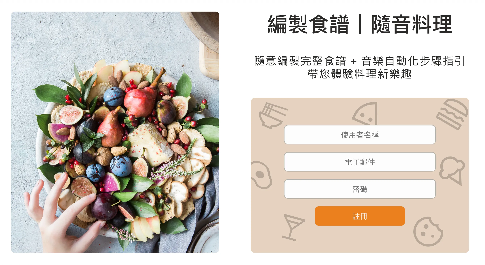
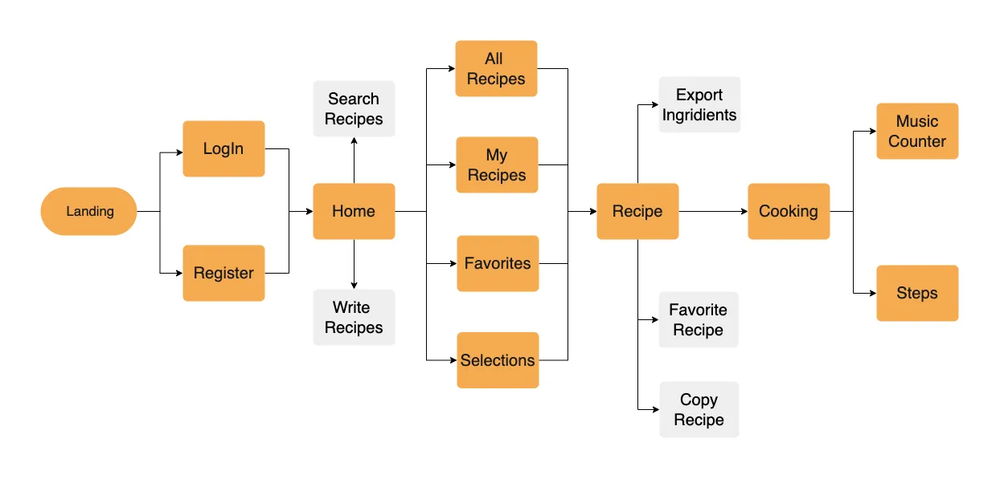
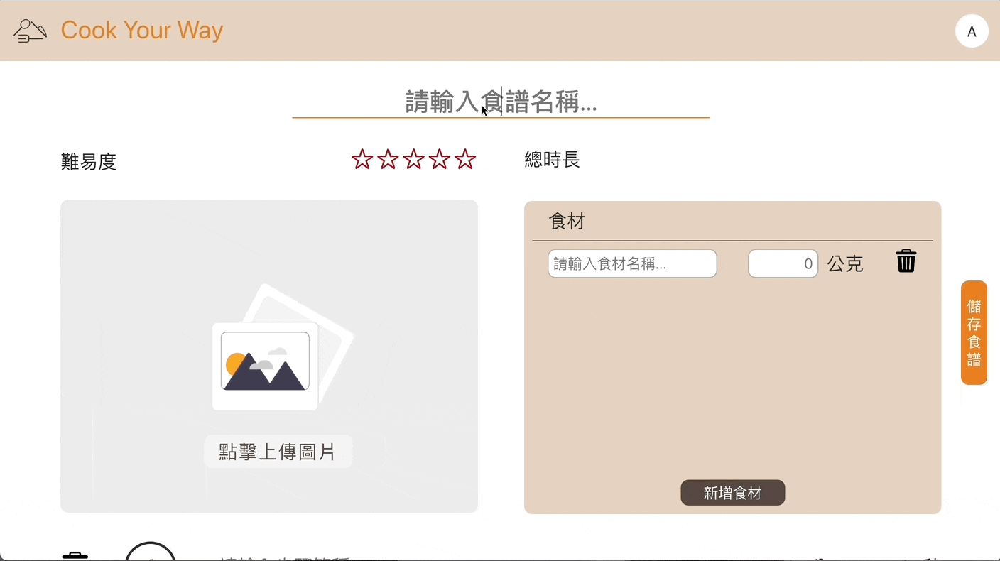
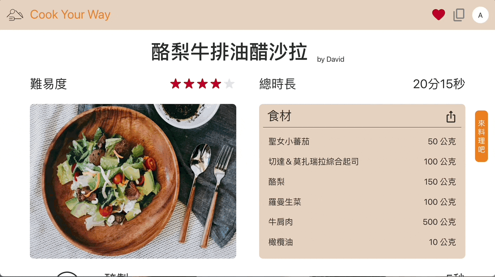
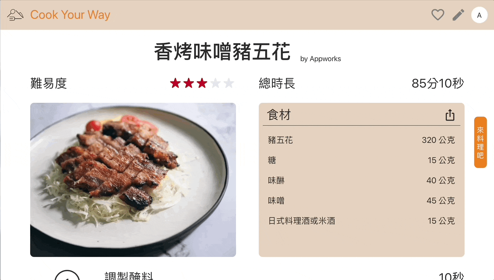

# Cook Your Way

> **Cook Your Way is an online recipe website with music timer and autoplay recipes**. Designed for users to read and follow recipes easily while cooking. 

## Cook, Share, and Explore Today!
Let's Turn Ingredients into Masterpieces: [Cook Your Way](https://cook-your-way.web.app/)

##### - Account for experiencing: test@test.test 
##### - Password for experiencing: 123456

## Main Features

- Built SPA website with React and React Router.
- Applied Web Audio API for background music of timer.
- Utilized Web Share API for ingredients export and Clipboard API as an alternative.
- Implemented UI for users to write recipes based on time, difficulty and upload images with Cloud Storage. 
- Established membership systems with Firebase Authentication and deployed with Firebase Hosting.
- Applied CRUD operation to write and favorite recipes with Firestore.

### Flow Chart

## Demo

- ### **Landing Page**

  > Welcome to Cook Your Way ! Start your journey from sign up / login.

  

- ### **Search Recipes**

  > Find the ideal recipe by searching with keywords.

  

- ### **Write Recipes**

  > Write recipes based on time, difficulty, ingredients, steps and even upload the images for your fabulous recipes.

  

- ### **Cooking**

  > Music starts to play when timer start counting. Once counter reaches zero, music and recipe step will automatically switch to the next. Timer will also be set according to the time of next step. 

  > Members can adjust recipe order and pause or reset timer manually as well.
  
  
- ### **Favorite Recipes**

  > Favorite the recipe you are interested in and check it in your favorite list.
  
  

- ### **Export recipe ingredients**

  > Export ingredients of the recipe to the notes
  or simply paste them to anyplace you like.
  
  

- ### **Copy Recipes**

  > Copy the recipe and improve it with single button. Members don't have to write one from scratch anymore. 
  
  

## Techniques

### Front-End Fundamental

- HTML / CSS / JavaScript
- Responsive Web Design (RWD)

### Libraries

- React
- React Router
- Styled Components
- Prop-types
### Cloud Services

- Firebase
  - Firestore database
  - Authentication
  - Storage
  - Hosting

### APIs

- Web Audio API
- Web Share API
- Clipboard API

## Packages

- [react-intersection-observer](https://github.com/thebuilder/react-intersection-observer)
- [react-toastify](https://github.com/fkhadra/react-toastify)
- [framer-motion](https://github.com/framer/motion)
- [uuid](https://github.com/uuidjs/uuid)

## Contact

Feel free to contact me if you have any suggestions.

David Kuo / dr.kuo15@gmail.com
